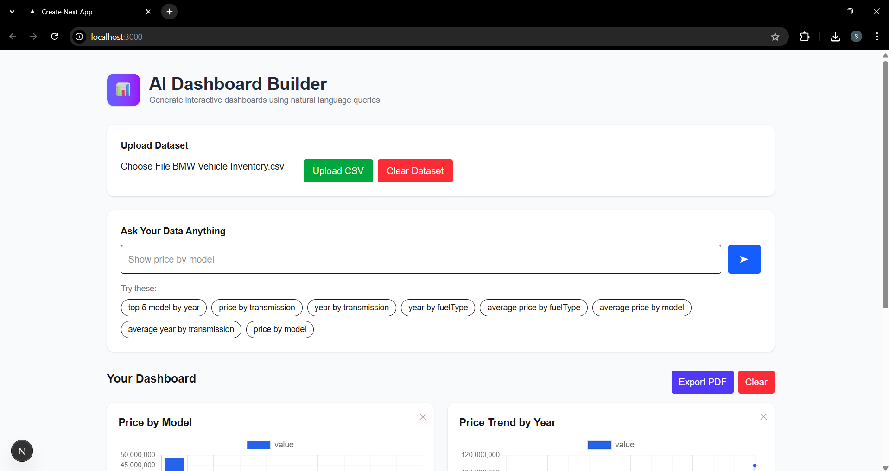

# AI Dashboard Builder

AI Dashboard Builder is an intelligent system that converts **natural language queries into interactive data visualizations**.
Users can upload any CSV dataset and generate dashboards simply by asking questions in plain English.

The system uses an AI-powered query planner to interpret user prompts and dynamically generate charts and insights.
Features
* Upload **any CSV dataset**
* Ask questions using **natural language**
* AI automatically generates **charts and dashboards**
* **Chat with dashboard** to refine analysis
* AI-generated **data insights**
* **Schema-aware query planner**
* Export dashboard to **PDF**
* Dataset-agnostic analytics

AI Engine

The AI engine interprets user queries and converts them into structured chart instructions.

Pipeline:
Upload Dataset
      ↓
Schema Detection
      ↓
AI Query Planner (LLM)
      ↓
Query Execution Engine
      ↓
Chart Generation
      ↓
Dashboard Widgets
```

The AI planner uses **Groq LLM (Llama-3.3-70B)** to understand natural language and generate structured instructions for chart creation.

## 🛠 Tech Stack

### Frontend

* Next.js
* React
* TypeScript
* Chart.js

### Backend

* FastAPI
* Pandas
* Python

### AI / LLM

* Groq API
* Llama-3.3-70B model

---

## 📊 Example Queries

Examples of questions users can ask:

```
Show average price by model
Top 5 expensive vehicles
Compare mileage and price by model
Price distribution by fuel type
Show price trend by year
```

The AI automatically converts these queries into the appropriate chart.

---

## 📂 Project Structure

```
ai-dashboard-builder
│
├── backend
│   ├── main.py
│   └── ai_engine
│       ├── insight_generator.py
│       ├── query_suggestions.py
│       └── widget_meta.py
│
├── frontend
│   ├── app
│   ├── components
│   └── styles
│
├── dashboard.png
├── requirements.txt
└── README.md
```

---

## ⚙️ Installation & Setup

### 1. Clone Repository
git clone https://github.com/Harikasonta/ai-dashboard-builder.git
cd ai-dashboard-builder

### 2. Backend Setup

Install dependencies:
pip install -r requirements.txt
Run backend server:
uvicorn main:app --reload
Backend runs on:
http://127.0.0.1:8000
### 3. Frontend Setup

Navigate to frontend folder:
cd frontend

Install dependencies:
npm install
Run development server:
npm run dev
Frontend runs on:
http://localhost:3000
## 📸 Dashboard Preview



## 📌 Future Improvements

* Natural language filters for charts
* Auto-generated dashboards
* Support for additional file formats (Excel, JSON)
* User authentication
* Dashboard sharing and collaboration

## 👩‍💻 Author
Harika sonta

## 📄 License

This project is for academic and educational purposes.
